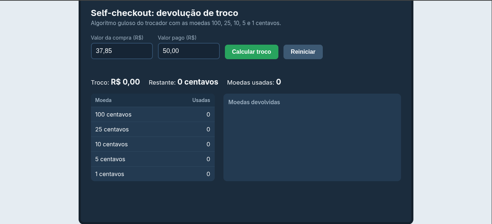
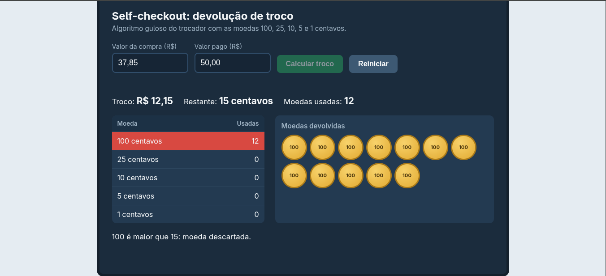
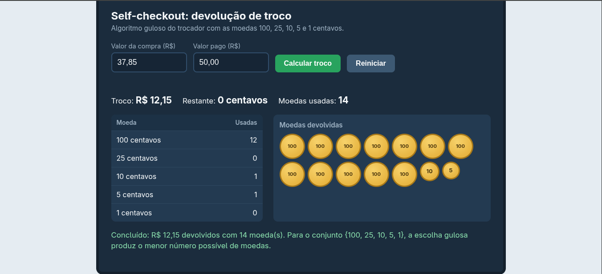

# Self-Checkout: Simulador do Algoritmo do Trocador (Coin Changing)

**Número da Lista**: 35<br>
**Conteúdo da Disciplina**: Algoritmos Gulosos <br>

## Alunos

| Matrícula | Aluno |
| -- | -- |
| 241025425 | Vinícius Araújo Oliveira |
| 221022480 | Carlos Henrique de Paiva Muniz |

## Sobre

Este projeto simula o funcionamento do troco em um terminal de autoatendimento (self-checkout) de supermercado, aplicando o **algoritmo guloso do trocador (Coin Changing)**. O sistema recebe o valor da compra e o valor pago em dinheiro, calcula o troco e determina a menor quantidade de moedas que o compõe.

O objetivo é tornar o algoritmo visível, reproduzindo de forma interativa a dinâmica apresentada nos slides da disciplina.

### Como o algoritmo funciona

As moedas disponíveis são **100, 25, 10, 5 e 1 centavos**, mantidas em ordem decrescente. A cada passo, o algoritmo compara a maior moeda ainda não descartada com o valor restante do troco:

1. Se a moeda é **maior** que o restante, ela é descartada (linha **vermelha**) e o algoritmo avança para a próxima denominação.
2. Se a moeda **cabe** no restante (linha **verde**), uma unidade dela é devolvida, o valor é subtraído do restante e um círculo representando a moeda é empilhado na tela.
3. O processo se repete até o restante chegar a zero.

```
troco(valor, moedas):          // moedas em ordem decrescente
    para cada moeda m em moedas:
        enquanto m <= valor:
            devolve m
            valor = valor - m
```

Todos os valores são tratados em **centavos inteiros**, o que evita os erros de ponto flutuante de operações com reais (por exemplo, `0.1 + 0.2`).

### Análise

| Aspecto | Resultado |
| -- | -- |
| Complexidade (versão sem animação) | O(k), com k = número de denominações |
| Passos da versão animada | No máximo k descartes mais o número de moedas devolvidas |
| Otimalidade | Garantida para o conjunto {100, 25, 10, 5, 1} |

### Limitação importante

A escolha gulosa **não é ótima para qualquer conjunto de moedas**. A garantia vale para sistemas ditos canônicos, como o utilizado aqui. Contraexemplo: com as moedas {1, 3, 4} e troco de 6, o guloso devolve 4 + 1 + 1 (3 moedas), enquanto o ótimo é 3 + 3 (2 moedas). Nesses casos, seria necessário programação dinâmica.

O conjunto de moedas adotado é o dos slides da disciplina e não corresponde ao sistema monetário brasileiro. Para alterá-lo, basta editar a constante `MOEDAS` no início do script do arquivo `index.html`.

### Tratamento de entradas

- Valores com vírgula ou ponto, com até 2 casas decimais (ex.: `37,85`).
- Valor pago menor que o da compra: exibe quanto falta.
- Pagamento exato: informa que não há troco.
- O botão **Reiniciar** interrompe uma animação em andamento.

## Screenshots

*(Nota: adicione as imagens reais na pasta `assets/` do repositório e substitua os links abaixo.)*


*Figura 1: Tela inicial com os campos de valor da compra e valor pago.*


*Figura 2: Execução passo a passo, com linhas vermelhas e verdes e as moedas sendo empilhadas.*


*Figura 3: Mensagem de conclusão com o total de moedas devolvidas.*

## Instalação

**Linguagem:** HTML5, CSS3 e JavaScript puro (Vanilla JS)<br>
**Dependências:** nenhuma

Não é necessário instalar Node.js, servidor ou bibliotecas. Siga os passos abaixo:

1. Clone este repositório:
```bash
git clone https://github.com/seu-usuario/seu-repositorio.git
cd seu-repositorio
```

2. Abra o arquivo `index.html` no navegador (dois cliques, ou pelo terminal):
```bash
# Windows:
start index.html

# Linux:
xdg-open index.html

# Mac:
open index.html
```

## Uso

1. Informe o **valor da compra** e o **valor pago**.
2. Clique em **Calcular troco** (ou pressione Enter).
3. Acompanhe a tabela de moedas e a pilha de moedas devolvidas.
4. Ao final, a mensagem de conclusão mostra o troco e o total de moedas.

## Estrutura do repositório

```
.
|--- src/
      |--- index.html
      |--- style.css
      |--- script.js

|--- README.md
|--- assets/        # Imagens usadas neste README
```
